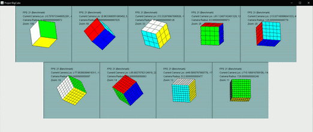
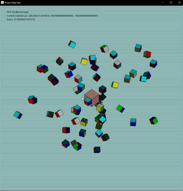

# OrthoGraphics

Hello! This is my custom ortographic-perspective graphics engine that I made for use in my BigCube project. Check it out [here](https://github.com/TheNightly/BigCube). All calculations are performed on CPU (not ideal, but I suspect that many solvers will be GPU bottlenecked with their ML components, so this is the solution that I came up with. This might be changed at a later date). Currently the render-time scales with the amount of vertices in the scene. Scenes are also modular per JPanel object so you can render multiple scenes in the same window, as long as they have different panels. an example of 7 different scenes being rendered simultaneously can be shown below. 

*7 scenes with different amounts of cubes and rotations being rendered simultaenously.*

As far as optimizations go, this engine only makes one optimization for rendering large scale hyper-cubes  (cubes subdivided into smaller cubes, like a rubick's cube). The scene will only render the the cube-sections which are visible on the hyper-cube as well as only the faces which are visible by the camera. The hyper-cube optimization currently only supports cubes, but the visible face optimization works on generalized convex polyhedra.

*125000 Cubes*

And just to prove this isn't lines drawn on a really big cube.

*With a 50x50x50 cube, this really kills the framerate.*

 As the project exists right now, there are quite a few couplings from Orthographics to BigCube, but I think the use case of this project is more specialized, so I will put it in its own repo, with the intent to decouple the two repos eventually, so it can be more general-use.

## Animations
Animations are implemented the simplest way possible - mapping out a desired change in world, and interpolating the changes to be executed across a given number of frames. With this formulations, animations can be easily disabled, changing the world-state instantly. In the above demo, we show a solver making random moves to the cube animated. This is the same scene without animations turned on. 

*Much faster!*

## Just a Fun Demo

*Little cubes orbitting a big cube at various orbits.*
